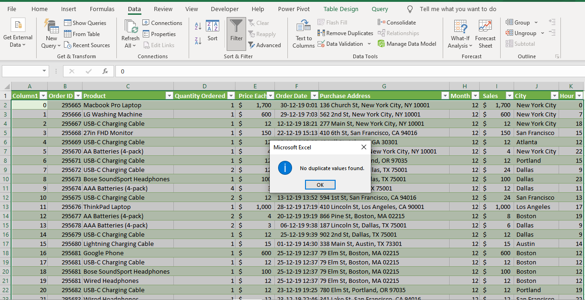
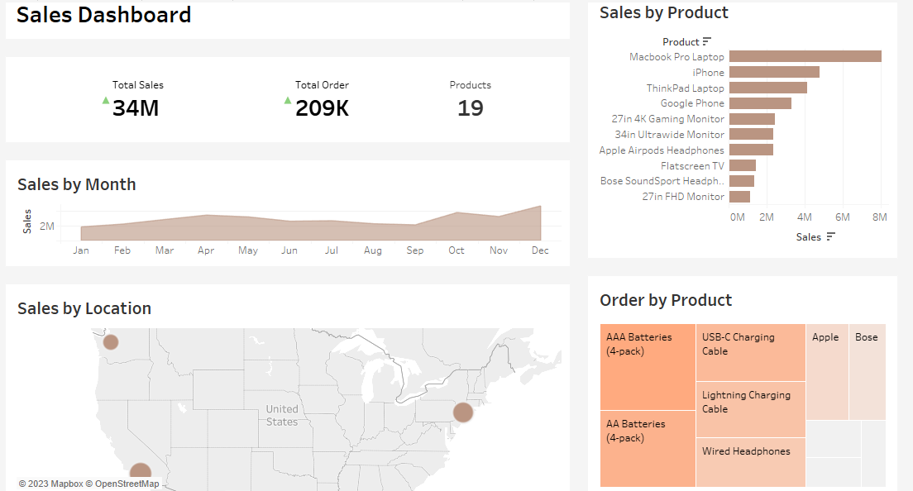

# MERISKILL-SALES-ANALYSIS

#  INTRODUCTION
This is a Tableau project on sales analysis by meriskill   the   project is to Analyze and derive insights to answer crucial questions and help the store make data driven decisions. The dataset, a csv file contained a single data table structure with 11 fields, 185,950 records Tableau was used for the analysis.
DISCLAIMER: datasets was downloaded from meriskill  as  an internship project. to demonstrate capabilities of Tableau.

##  Problem Statement
1.	What is the Revenue metrics.
2.	What are the best selling products.
3.	Identify sales trend over time.
4.	Where does revenue come from.
However, emphasis was placed on identifying ways of improving and strengthening the company’s revenue performance.

##  Skills / Concepts Demonstrated
-	Data Connection.
-	Data cleaning (using data interpreter).
-	Calculations and formulas to perform custom calculations and create new metrics tailored to sales analysis.
-	Trend analysis.
-	Mapping.

  ## Data Transformation
  
Data cleaning and transformation was carried  out using Microsoft excel, to ensure data quality I did another cleaning in Tableau using Data Interpreter.
-	After scrutinizing all the columns, they were found to be valid and devoid of empty cells and errors.
-	I checked for Duplicates value.

  ## Data Modelling
No modelling was required since we need just a table for the analysis.

##  Visualization
Having done the necessary cleaning and transformation, I loaded the datasets into my Tableau Desktop for analysis and dashboard creation. Below is the generated report.

For an interactive view of this dashboard see [here](https://public.tableau.com/views/MeriSkil-Project/Meriskil-Sales-Dashboard?:language=en-US&publish=yes&:display_count=n&:origin=viz_share_link)

## Conclusion & Recommendation
The visual was able to show the Revenue metrics, top selling products, most ordered product, top sales by location, and sales trend over time.
-	It showed that December was the month which had the highest sales by revenue generated.
-	The fourth quarter having the highest revenue, Macbook pro laptop generate the highest revenue though its not the highest sold product (due to its cost).
-	AAA batteries has the highest sales by quantity ordered.
-	San Francisco is the city with the highest generated revenue.
  
To boost revenue generation, the company was advised to do the following
1.	Carry out a market basket analysis to identify customer purchse pattern
2.	Ensure that top category products are always in stock especially in top performing locations
3.	Reward top performing employees
4.	Improve general working conditions

